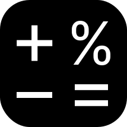

# SADCalculator

SADCalculator provides a simple way for day-traders to calculate their Stock Average Down (SAD). The website is 
built in Python and Streamlit.

You can visit the website [here](https://sadcalculator.streamlit.app/).